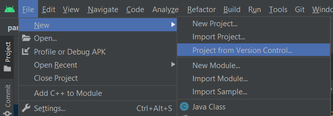
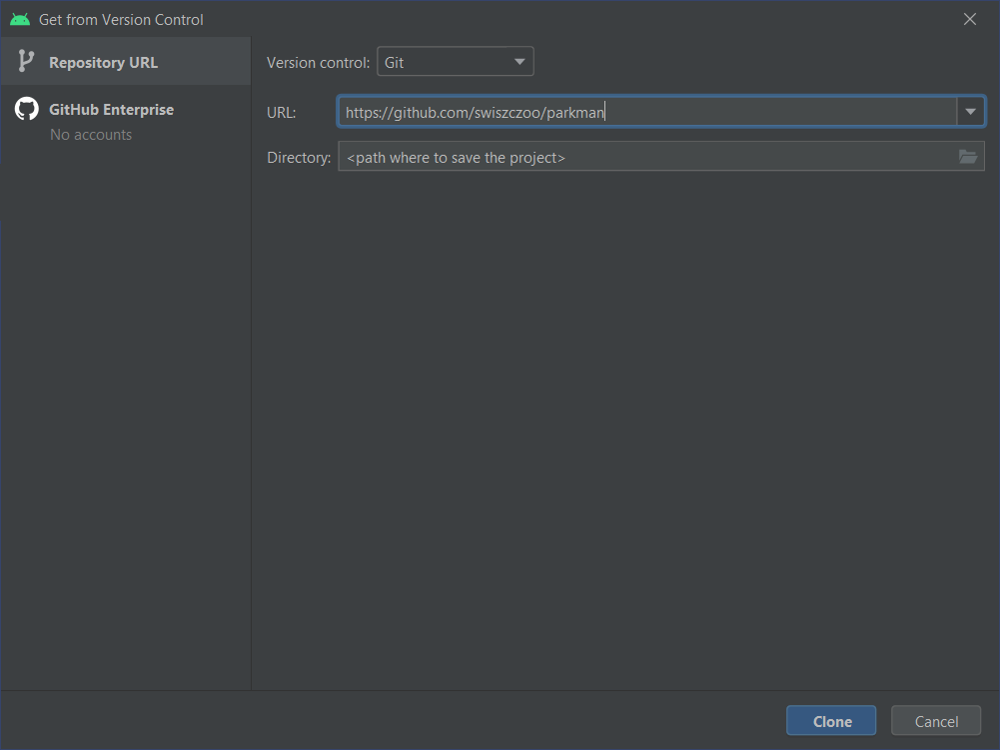
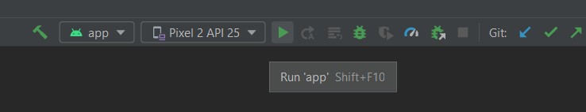
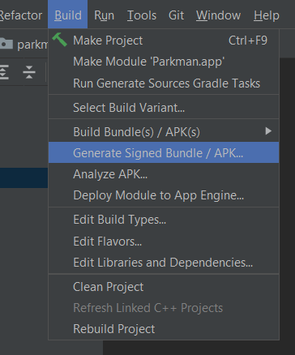
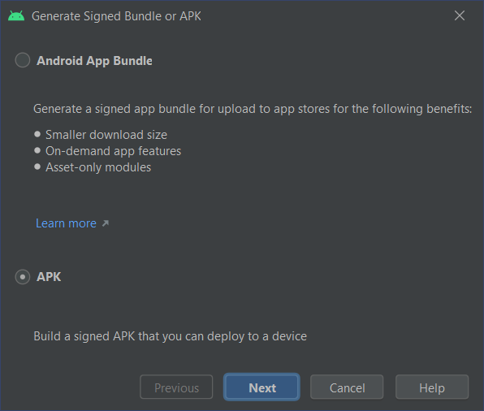

# Building Parkman

Steps to build Parkman are pretty straightforward, as Gradle automates the entire build process,
along with getting dependencies from Maven repository. Anyway, here are the steps to build Parkman
using Android Studio

## Step 1
Open Android Studio. In the `File` menu, select `New > Project from Version control` 

## Step 2
Fill in the repository details in the dialog box that just appeared. Remember to specify the
correct path in the `Directory` field. Then click the `Clone` button.

## Step 3
Wait for the Gradle Sync process to finish. As for now, all dependencies should have been
installed. To run the app, click on the green arrow button, labeled as `Run 'app'`.
If no emulators where running, a new instance should launch.

## Building a release APK
To build a release APK, select `Build > Generate Signed Bundle / APK...`.

This should open up a wizard. On its first page select `APK` option, then follow its steps, such
as signing your APK with key stored in the keystore.

