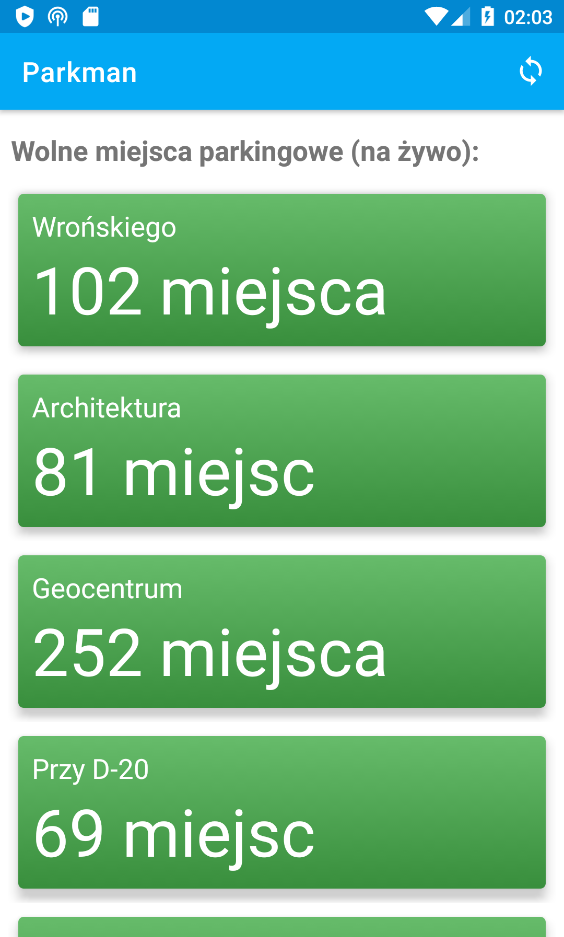

# Parkman
An Android app which monitors free parking places on all WUST 
(Wroclaw University of Science and Technology) public parkings 
in realtime, using API on 
[https://iparking.pwr.edu.pl/](https://iparking.pwr.edu.pl/).

Project to externally pass the Programowanie Strukturalne
i Obiektowe (Object and Structural Programming) course on 
Informatyka Stosowana (Applied Computer Science) at WUST.

## Screenshot

